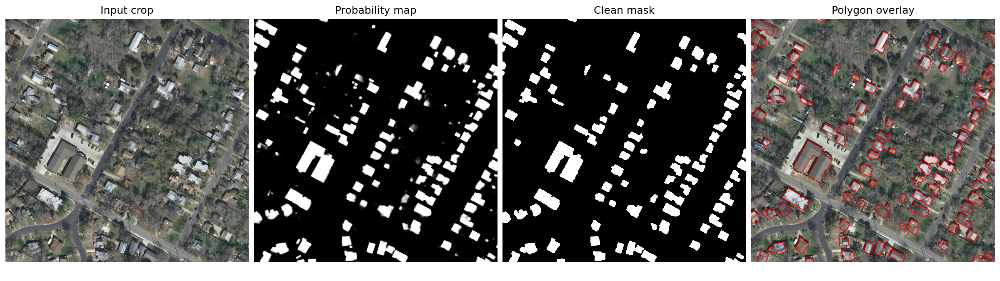

# seg2gis


**From aerial imagery to candidate building footprints for GIS.**

seg2gis is a configurable raster-to-vector pipeline for building segmentation,
full-scene inference, mask post-processing, polygon simplification, and
georeferenced GeoJSON export. It was developed for a master's thesis.

The experiments below use INRIA data. To apply a trained model to other data,
see [Use your own imagery](#use-your-own-imagery); to train and evaluate the
reported model, see [Reproduce the INRIA experiments](#reproduce-the-inria-experiments).



<p align="center"><em>Held-out aerial crop: input → probability map → cleaned mask → polygon overlay.</em></p>

## Pipeline

```text
RGB aerial scene → overlapping tile inference → probability map
                 → mask cleanup → contour extraction
                 → polygon simplification → GeoJSON
```

- Training with U-Net, FPN, and DeepLabV3+, geometric augmentation, and boundary-weighted loss.
- Configurable tiling, inference, mask cleanup, and polygon simplification.
- Raster, boundary, component, and vector-quality diagnostics.
- Georeferenced export using the source raster transform and coordinate reference system (CRS).

## INRIA experiments

### Evaluation protocol

Experiments use the 180 labelled images from the
[INRIA Aerial Image Labeling Dataset](https://project.inria.fr/aerialimagelabeling/):
five cities, with 36 images of `5000 × 5000 px` per city. Complete scenes are
assigned to a split before tiling, preventing spatially related tiles from
leaking across training and evaluation.

| Split | Image IDs per city | Scenes | Purpose |
| --- | --- | ---: | --- |
| Train | 11–36 | 130 | Model fitting |
| Validation | 6–10 | 25 | Model and post-processing selection |
| Held-out test | 1–5 | 25 | Final reporting |

The held-out set follows the labelled first-five-per-city convention often
called INRIA(155). It is not the benchmark's unlabelled official test set.

### Segmentation results

The model selected on validation data is a **U-Net with an EfficientNet-B3
encoder**, geometric augmentation, and Dice plus boundary-weighted binary
cross-entropy.

The fixed baseline uses threshold `0.50`, minimum component area `500 px`, and
an opening kernel of `5 px`.

| Split | IoU | Dice/F1 | Precision | Recall | BF1 @2 px | BF1 @5 px |
| --- | ---: | ---: | ---: | ---: | ---: | ---: |
| Validation | 0.8016 | 0.8899 | 0.9052 | 0.8751 | 0.6246 | 0.8023 |
| Held-out test | 0.7876 | 0.8812 | 0.9064 | 0.8573 | 0.6307 | 0.7981 |

Precision exceeds recall, reflecting missed building area. Boundary F1 (BF1)
is lower at the tighter tolerance: good area overlap does not imply precise outlines.

### Vector results

The vector pipeline uses a separate configuration selected on validation data:
threshold `0.47`, minimum component area `100 px`, opening kernel `3 px`, and
Douglas–Peucker epsilon ratio `0.002`. These values are fixed before evaluating
the held-out split.

On the held-out scenes, the cleaned mask reaches `0.8023` IoU. After contour
extraction and simplification, polygon-raster IoU is `0.7736`, and `0.54%` of
the exported polygons are invalid. The pipeline produces 25,564 polygons for
32,794 reference connected components; component AP is `0.6021` at IoU 0.50
and `0.3826` at IoU 0.75. Remaining errors include missed small buildings,
merged adjacent roofs, and imprecise boundaries.

Results are backed by committed CSV files:
[model selection](results/tables/phase2_augmentation_training_metrics.csv),
[full-image validation](results/tables/phase2_full_image_validation_metrics_by_city.csv),
[full-image test](results/tables/phase2_full_image_test_metrics_by_city.csv),
[post-processing selection](results/tables/postprocess_ablation_validation_summary.csv),
[vector quality](results/tables/vector_quality_test_best_val_config_summary.csv),
and [component diagnostics](results/tables/instance_ap_test_best_val_config_by_city.csv).

## Installation

Use Python 3.11. Commands below use PowerShell and run from the repository root.

Trained checkpoints are not included. Train a model using the
[INRIA workflow](#reproduce-the-inria-experiments) or supply a compatible checkpoint.

Create the environment with Conda:

```powershell
conda env create -f environment.yml
conda activate seg2gis
```

For a pip-only environment:

```powershell
python -m venv .venv
.venv\Scripts\Activate.ps1
python -m pip install --upgrade pip
python -m pip install -r requirements.txt
```

For CUDA acceleration, install the PyTorch build matching the local CUDA
version before installing the remaining dependencies.

## Use your own imagery

Inference requires an 8-bit RGB georeferenced raster and a trained checkpoint.
Use a config with the same model architecture and encoder as the checkpoint;
[configs/default.json](configs/default.json) provides the configuration structure.

```powershell
python scripts/predict_full_image.py `
  --config "path/to/model-config.json" `
  --model_path "path/to/checkpoint.pth" `
  --image_path "path/to/rgb-raster.tif" `
  --output_name "prediction"
```

Inference writes probability maps, raw and cleaned masks, polygon previews,
and GeoJSON to `results/full_predictions/` by default. Coordinates use the
source raster transform and CRS. Vector-area filtering requires a projected
CRS; for geographic-coordinate rasters, reproject or use `--vector_min_area 0`.

The supplied settings and reported scores are specific to INRIA. For other
regions or image resolutions, validate the model and retune post-processing;
retraining may be needed. Inference does not require the INRIA directory layout.

## Reproduce the INRIA experiments

### 1. Prepare the data and tiles

Download the INRIA dataset and arrange it as follows:

```text
data/AerialImageDataset/
  train/
    images/
    gt/
  test/
    images/
```

The labelled images under `train/` supply all three local splits. The public
`test/` images have no labels and are not used in the reported metrics.

```powershell
python scripts/prepare_tiles.py --config configs/default.json
```

This applies the scene-level split above, then extracts `256 × 256 px` tiles.

### 2. Train the selected model

Generate the run configurations from the experiment manifest, without starting
training, then train the selected run:

```powershell
python scripts/run_experiments.py `
  --experiments_config configs/experiments_phase2_augmentation_boundary_loss.yaml `
  --dry_run

python src/train.py `
  --config configs/generated/phase2_unet_effb3_aug_boundary_bce_w2_e50.json
```

Run configs are generated in `configs/generated/` and ignored by Git. To train
the complete final comparison, omit `--dry_run` from the experiment command.
Checkpoints are saved under `model.model_dir` using `training.run_name`;
the generated config also sets the inference checkpoint path.

### 3. Evaluate full images

```powershell
$CFG = "configs/generated/phase2_unet_effb3_aug_boundary_bce_w2_e50.json"
python src/evaluate.py --config $CFG --split val
python src/evaluate.py --config $CFG --split test
```

These commands reproduce the fixed `0.50/500/5` full-image baseline. The
validation-selected vector settings are supplied explicitly in the next step.

### 4. Export building polygons

Use the validation-selected vector settings with the trained model:

```powershell
$CFG = "configs/generated/phase2_unet_effb3_aug_boundary_bce_w2_e50.json"
python scripts/predict_full_image.py `
  --config $CFG `
  --image_path "data/AerialImageDataset/train/images/austin1.tif" `
  --threshold 0.47 `
  --min_area 100 `
  --open_kernel_size 3 `
  --epsilon_ratio 0.002 `
  --output_name "austin1"
```

## Repository map

```text
configs/          base configuration and experiment manifests
scripts/          preparation, experiment, inference, and analysis commands
src/              training, metrics, post-processing, and vectorisation code
tests/            path-safety and configuration regression tests
results/tables/   numerical evidence committed as CSV
results/figures/  curated qualitative and analytical figures
```

## Citation and license

The dataset was introduced by E. Maggiori, Y. Tarabalka, G. Charpiat, and
P. Alliez in
[“Can Semantic Labeling Methods Generalize to Any City? The Inria Aerial Image Labeling Benchmark”](https://doi.org/10.1109/IGARSS.2017.8127684),
IGARSS 2017.

Code is released under the [MIT License](LICENSE). The INRIA dataset remains
subject to its own terms.
