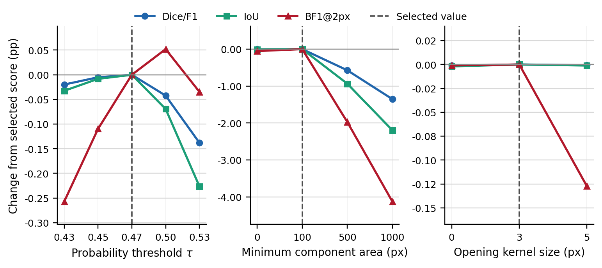

# seg2gis


**From aerial pixels to GIS-ready building-footprint candidates.**

seg2gis is an end-to-end research pipeline for semantic building segmentation,
full-scene inference, mask post-processing, contour simplification, and
georeferenced GeoJSON export. It evaluates the complete raster-to-vector path
instead of treating pixel overlap as the only measure of success.


<p align="center"><em>Aerial image → probability map → cleaned building mask → polygon overlay.</em></p>

## What it does

```text
aerial scenes → image-level split → 256 px tiles → segmentation model
              → overlapping full-image inference → mask cleanup
              → contour extraction + simplification → GeoJSON
```

- Compares U-Net, FPN, and DeepLabV3+ segmentation models.
- Supports geometric augmentation and boundary-weighted training.
- Runs overlapping tiled inference on complete aerial scenes.
- Selects thresholding and post-processing settings on validation data only.
- Reports raster, boundary, component-level, and vector-quality diagnostics.
- Exports polygons in the source raster coordinate reference system.

## Selected model

The selected configuration is a **U-Net with an EfficientNet-B3 encoder**,
geometric augmentation, and Dice plus boundary-weighted binary cross-entropy:

```text
phase2_unet_effb3_aug_boundary_bce_w2_e50
```

Training uses AdamW for 50 epochs with a learning rate of `1e-4`, cosine
annealing, seed `42`, boundary weight `2.0`, and boundary width `3 px`.

### Full-image segmentation

These results use the default evaluation configuration: threshold `0.50`,
minimum component area `500 px`, and morphological opening kernel `5 px`.

| Split | IoU | Dice/F1 | Precision | Recall | BF1 @2 px | BF1 @5 px |
| --- | ---: | ---: | ---: | ---: | ---: | ---: |
| Validation | 0.8016 | 0.8899 | 0.9052 | 0.8751 | 0.6246 | 0.8023 |
| Held-out test | 0.7876 | 0.8812 | 0.9064 | 0.8573 | 0.6307 | 0.7981 |

### Vector analysis

Vector diagnostics use settings chosen on validation data and then fixed:
threshold `0.47`, minimum area `100 px`, opening kernel `3 px`, and
Douglas–Peucker epsilon ratio `0.002`.

| Split | Polygon-raster IoU | Invalid polygons | Predicted / GT area | Component mAP @50:95 |
| --- | ---: | ---: | ---: | ---: |
| Validation | 0.7602 | 0.60% | 1.0020 | 0.3304 |
| Held-out test | 0.7736 | 0.54% | 0.9857 | 0.3622 |

Component AP is a diagnostic derived from connected components because the
dataset provides semantic masks rather than official instance annotations.

<p align="center">
  
</p>

<p align="center"><em>Validation sensitivity relative to the selected vector configuration; dashed lines mark the chosen values.</em></p>

## Evaluation protocol

Experiments use five labelled cities—Austin, Chicago, Kitsap, Tyrol-w, and
Vienna—with complete scenes assigned to a split before tiling. This prevents
tiles from the same source image leaking across training and evaluation.

| Split | Image IDs per city | Scenes | Role |
| --- | --- | ---: | --- |
| Train | 11–36 | 130 | Model fitting |
| Validation | 6–10 | 25 | Model and post-processing selection |
| Held-out test | 1–5 | 25 | Final evaluation |

## Installation

The recommended environment uses Python 3.11:

```powershell
conda env create -f environment.yml
conda activate seg2gis
```

For a pip-only setup:

```powershell
python -m venv .venv
.venv\Scripts\Activate.ps1
python -m pip install --upgrade pip
python -m pip install -r requirements.txt
```

For CUDA acceleration, install the PyTorch build matching the local CUDA
version before installing the remaining dependencies.

## Data

Download the
[Inria Aerial Image Labeling Dataset](https://project.inria.fr/aerialimagelabeling/)
and arrange it as follows:

```text
data/AerialImageDataset/
  train/
    images/
    gt/
  test/
    images/
```

The dataset, prepared tiles, and trained checkpoints are intentionally not
included in the repository.

## Run the pipeline

Run all commands from the repository root.

### 1. Prepare tiles

```powershell
python scripts/prepare_tiles.py --config configs/default.json
```

The safety checks only allow the script to replace a dedicated tile directory
inside the repository's `data/` directory.

### 2. Train models

```powershell
python src/train.py --config configs/default.json
```

To run a batch of configurations, pass an experiment manifest to the experiment
runner:

```powershell
python scripts/run_experiments.py --experiments_config <path-to-experiment-yaml>
```

The repository includes manifests for the Phase 1 architecture screen and the
Phase 2 augmentation and boundary-loss study under `configs/`. Each manifest is
merged with `configs/default.json`, and the resulting per-run configurations
are written under `configs/generated/`.

Checkpoint locations are determined by each configuration's `model.model_dir`
and `training.run_name`. Checkpoints are not distributed with the repository,
so later stages require either a locally trained checkpoint or an explicit
`--model_path`.

### 3. Evaluate a model

```powershell
python src/evaluate.py --config <path-to-generated-config.json> --split val
python src/evaluate.py --config <path-to-generated-config.json> --split test
```

Use validation results to select the model and post-processing settings; reserve
the held-out test split for final evaluation after those choices are fixed.

### 4. Export building polygons

```powershell
python scripts/predict_full_image.py `
  --config <path-to-generated-config.json> `
  --image_path <path-to-georeferenced-raster.tif> `
  --output_name <output-name>
```

Threshold, morphology, simplification, output directory, and vector-area
settings can be supplied as command-line overrides; otherwise the selected
configuration provides their defaults.

The default output directory is `results/full_predictions/`:

```text
<name>_prob.npy
<name>_prob.png
<name>_mask.png
<name>_clean_mask.png
<name>_polygons_overlay.png
<name>_showcase_crop.png
<name>_buildings.geojson
```

GeoJSON export preserves the source raster transform and CRS. Area filtering
expects a projected CRS; geographic-coordinate rasters must be reprojected,
used with `--vector_min_area 0`, or explicitly allowed when square-degree
filtering is intentional.

## Repository map

```text
configs/          base, experiment, and generated run configurations
scripts/          tiling, experiment orchestration, inference, and analyses
src/              training, datasets, metrics, post-processing, vectorisation
tests/            path-safety and generated-configuration regression tests
results/tables/   committed numerical evidence
results/figures/  curated qualitative and analytical figures
```

The main result tables are committed as CSV files so reported values remain
inspectable without rerunning GPU-intensive experiments.

## Dataset citation

The benchmark was introduced by E. Maggiori, Y. Tarabalka, G. Charpiat, and
P. Alliez in
[“Can Semantic Labeling Methods Generalize to Any City? The Inria Aerial Image Labeling Benchmark”](https://doi.org/10.1109/IGARSS.2017.8127684),
IGARSS 2017.

## License

Code is released under the [MIT License](LICENSE). The Inria dataset remains
subject to its own terms.
