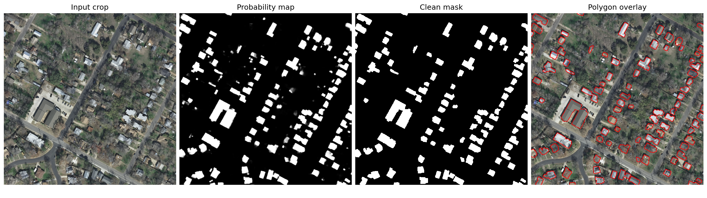

# seg2gis

[](https://github.com/josedelrey/seg2gis/actions/workflows/tests.yml)


seg2gis turns RGB aerial imagery into building footprints. It predicts a
building mask, cleans the mask, traces polygons, and exports georeferenced
GeoJSON. The repository includes a pretrained U-Net with an EfficientNet-B3
encoder, plus code to train and evaluate a model on labelled imagery.



## Install

Supported on Linux with Python 3.11. Requires [Git](https://git-scm.com/downloads)
and [uv](https://docs.astral.sh/uv/getting-started/installation/).

```bash
git clone https://github.com/josedelrey/seg2gis.git
cd seg2gis
uv sync --locked --extra cpu
source .venv/bin/activate
```

For an NVIDIA GPU with CUDA 12.6 support, install the CUDA dependencies instead:

```bash
uv sync --locked --extra cuda126
```

## Predict building footprints

Create `models/` and save the [pretrained checkpoint](https://github.com/josedelrey/seg2gis/releases/download/v1.0.0/seg2gis.pth)
as `models/seg2gis.pth`. The input must be a three-band RGB georeferenced
raster. Run inference with:

```bash
python scripts/predict_full_image.py \
  --config configs/pretrained_unet_effb3.json \
  --image_path "path/to/rgb-raster.tif" \
  --output_name "prediction"
```

Outputs go to `results/full_predictions/` unless you set `--out_dir`. With the
command above, the main files are:

| File | Use |
| --- | --- |
| `prediction_buildings.geojson` | Building polygons for GIS |
| `prediction_polygons_overlay.png` | Polygon outlines over the input image |
| `prediction_clean_mask.png` | Binary mask after cleanup |
| `prediction_prob.npy` | Per-pixel building probabilities |

The GeoJSON uses the input raster's coordinate reference system. Reproject it
to WGS84 if your GIS workflow requires RFC 7946 GeoJSON. The
[inference guide](docs/inference.md) lists every output and the available settings.

## Train on your own imagery

Prepare separate training and validation sets of paired RGB image and building
mask PNG tiles, such as `256 × 256 px` tiles. Image and mask filenames must
match within each split:

```text
data/my_tiles/
  train/images/scene_001.png
  train/masks/scene_001.png
  val/images/scene_002.png
  val/masks/scene_002.png
```

Use white pixels for buildings and black pixels for background in the masks.
Copy [configs/default.json](configs/default.json) to a new JSON file. Point
`data.train_image_dir`, `data.train_mask_dir`, `data.val_image_dir`, and
`data.val_mask_dir` at your folders. Set a unique `training.run_name` and
`training.experiment_log_path`. Set `protocol.name` to your dataset name and
its three image ID lists to `[]`. Those IDs describe the INRIA split and are
not used to load the prepared tiles. Then train:

```bash
python -m seg2gis.train --config path/to/your-config.json
```

The best checkpoint is saved under `model.model_dir` as `<run_name>.pth`. To
predict with it, pass `--model_path` and use a config with the same model
architecture and encoder.

## Results

The reported model was trained and evaluated on scene-level splits of the
[INRIA Aerial Image Labeling Dataset](https://project.inria.fr/aerialimagelabeling/).
The held-out test uses five labelled scenes from each of the five cities.

| Split | Segmentation IoU | Dice/F1 |
| --- | ---: | ---: |
| Validation | 0.8016 | 0.8899 |
| Held-out test | 0.7876 | 0.8812 |

On the held-out scenes, exported polygons reach **0.7736 polygon-raster IoU**,
and 99.46% are valid. See the [INRIA experiments](docs/experiments.md) for the
full protocol, vector metrics, and reproduction steps.

## Tests

After installing dependencies, run the unit tests from the repository root.
They cover data loading, prediction, postprocessing, metrics, and GeoJSON export.

```bash
python -m unittest discover -s tests -v
```

## Citation and license

The INRIA dataset was introduced by E. Maggiori, Y. Tarabalka, G. Charpiat,
and P. Alliez in
[“Can Semantic Labeling Methods Generalize to Any City? The Inria Aerial Image Labeling Benchmark”](https://doi.org/10.1109/IGARSS.2017.8127684),
IGARSS 2017.

The code and released checkpoint are covered by the [MIT License](LICENSE).
The INRIA dataset has its own terms.
